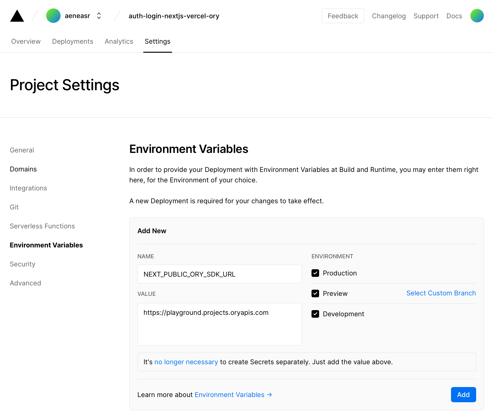
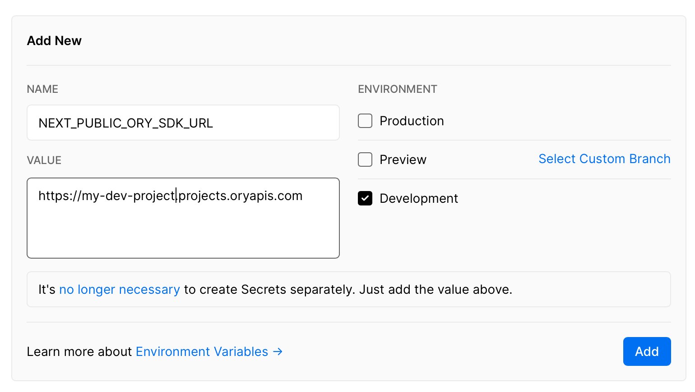
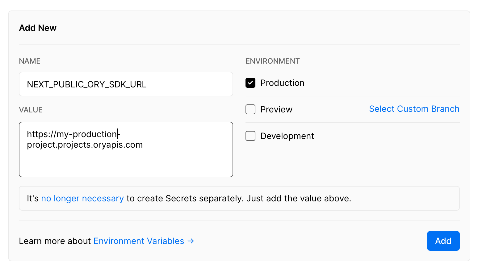
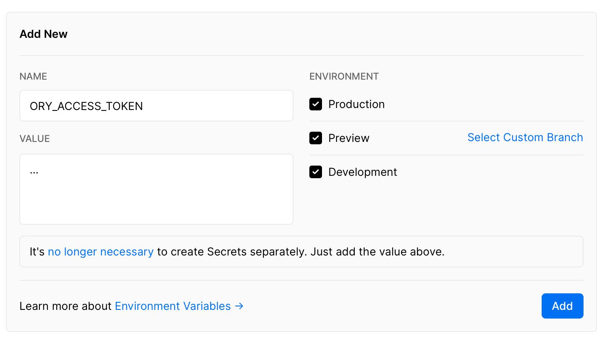

Reading this guide you will implement a ReactJS application with
[a page which shows if the user is logged in or not](https://github.com/ory/react-nextjs-example/blob/d026c7f0c2f296bf38947810d9394b05f927d6a0/pages/index.tsx),
[a page](pages/protected.tsx) using an [API endpoint](https://github.com/ory/react-nextjs-example/blob/d026c7f0c2f296bf38947810d9394b05f927d6a0/pages/api/protected.ts)
which is protected,
[login](https://github.com/ory/react-nextjs-example/blob/d026c7f0c2f296bf38947810d9394b05f927d6a0/pages/login.tsx),
[registration](https://github.com/ory/react-nextjs-example/blob/d026c7f0c2f296bf38947810d9394b05f927d6a0/pages/ui/registration.tsx),
[account settings](https://github.com/ory/react-nextjs-example/blob/d026c7f0c2f296bf38947810d9394b05f927d6a0/pages/ui/settings.tsx),
[account verification](https://github.com/ory/react-nextjs-example/blob/d026c7f0c2f296bf38947810d9394b05f927d6a0/pages/ui/verification.tsx) (e.g. email, phone, activate
account),
[account verification](https://github.com/ory/react-nextjs-example/blob/d026c7f0c2f296bf38947810d9394b05f927d6a0/pages/ui/recovery.tsx) (e.g. reset password),
using the NextJS framework and deploy it to Vercel. You can see this app in action at **[https://auth-login-nextjs-vercel-ory.vercel.app](https://auth-login-nextjs-vercel-ory.vercel.app)**.

import CodeFromRemote from '../../components/freestanding/utils/codefromremote'

What is special about this application is that no session management, cookies, or backend is needed! To implement the logic
for login, registration, account recovery, session management, MFA we will be relying on the Open Source project [Ory Kratos](https://github.com/ory/kratos)
which is also available as a managed cloud service at [Ory Cloud](https://www.ory.sh/).

We chose [NextJS](https://nextjs.org) and [Vercel](https://vercel.com/) as the framework to keep boilerplate small and offer a fast deployment option. Of course, this style of
integration works with all [React](https://reactjs.org) apps! We also have options

To avoid the complexity of setting up routing and state management and in the
hopes of making this example easy to consume, we have chosen NextJS as the
framework.

The structure of this guide is as follows:

1. Get up and running with a quick example
2. Set up the example with Ory Kratos via Ory Cloud
3. Set up the example with self-hosted Ory Kratos
4. Explanations and code examples

## Start Hacking

Per default this project is using the Ory Cloud Playground. This allows you to just clone the repository and
bring it live with:

```
git clone https://github.com/ory/react-nextjs-example.git
cd react-nextjs-example
npm i
npm run dev
```

Next head over to [http://localhost:3000/](http://localhost:3000/) to see the
app in action with login, registration - a working user management!

You can even deploy it immediately to Vercel with:

```
npx vercel --prod
```

Follow allong in the next chapters to learn how to connect your own Open Source Ory Kratos installation or Ory Cloud Project.

## Running Ory Kratos on Ory Cloud

Get started by
[signing up for an Ory Cloud account](https://console.ory.sh/registration) and
creating your first
[Ory Cloud Project](https://www.ory.sh/docs/start-building/create-project). Then
get the Project's
[SDK Configuration](https://www.ory.sh/docs/concepts/services-api/#sdk-configuration)
and set it in your environment and start the process:

```
npm i
export NEXT_PUBLIC_ORY_SDK_URL=https://...
npm run dev
```

Per default, this project is using the Ory Cloud Playgorund. One NextJS API route is using
the Ory Kratos / Ory Cloud Admin API to load the user's identity, which is why you can
optionally set up an [Ory Personal Access Token](https://www.ory.sh/docs/guides/create-personal-access-token) as well:

```
npm i
export NEXT_PUBLIC_ORY_SDK_URL=https://...
export ORY_ACCESS_TOKEN=...
npm run dev
```

Next head over to [http://localhost:3000/](http://localhost:3000/) to see the
app in action with login, registration - a working user management!

#### Additional Configuration

To get everything to work smoothly, we recommend setting the appropriate UI
endpoints in your Ory Cloud Project under the "User Interface" menu item. If you are developing locally on port `3000` this would be:

- Login UI: `http://localhost:3000/login`
- Registration UI: `http://localhost:3000/registration`
- Settings UI: `http://localhost:3000/settings`
- Verification UI: `http://localhost:3000/verification`
- Recovery UI: `http://localhost:3000/recovery`
- Error UI: `http://localhost:3000/error`


Also, ensure to set up your redirects correctly, so you end up at the right
endpoint after you have signed up or signed in!


We are setting these values to ensure that all flows (e.g. clicking on that
password reset link) end up at your application. If you deploy to production,
set these values to your production URL!

#### Deploy on Vercel with Ory Cloud

The easiest way to deploy your Next.js + Ory Cloud app is to use the
[Vercel Platform](https://vercel.com/new?utm_medium=default-template&filter=next.js&utm_source=create-next-app&utm_campaign=create-next-app-readme)
from the creators of Next.js.

If you have never deployed on Vercel, check out the
[Next.js deployment documentation](https://nextjs.org/docs/deployment) for more
details.

Deploying the app is easy. Ensure that your build works by running

```
npm run build
```

Then, set up your [Vercel](https://vercel.com/) account and create a new app.
You will need to configure your
[Ory Cloud Project SDK URL](https://www.ory.sh/docs/concepts/services-api) in your Vercel deployment:



By the way! If you want to use separate Ory Cloud Projects for staging, production, and development then use different Ory Cloud Project SDK URLs
for the different environments by un/selecting the checkboxes in the Vercel UI:





If you want to call Ory Cloud's Admin APIs from your serverless functions, optionally set up the [Ory Personal Access Token](https://www.ory.sh/docs/guides/create-personal-access-token):



Next all you need to do is to run the deploy command and connect it to the project you created:

```
npx vercel deploy --prod
```

This also works with Vercel PR Preview!

### Deploy Ory Kratos Yourself

Of course, this application also integrates with Open Source Ory Kratos! Instead
of setting up the `NEXT_PUBLIC_NEXT_PUBLIC_ORY_SDK_URL` you will need to set the environment variable
`NEXT_PUBLIC_ORY_KRATOS_PUBLIC` to your Ory Kratos public API!

If you are running the
[Ory Kratos Quickstart](https://www.ory.sh/kratos/docs/quickstart) the correct value is:

```
export NEXT_PUBLIC_ORY_KRATOS_PUBLIC=http://localhost:4433
```

#### CORS

Please be aware that you need to add the port where your NextJS is running to
the list of allowed CORS origins. You also need to allow some headers.

If you are running

```yaml
serve:
  public:
    cors:
      enabled: true
      allowed_origins:
        - http://localhost:3000
      allowed_headers:
        - Authorization
        - Content-Type
        - X-Session-Token
```

#### Deploy to Production

Ory Kratos can be deployed almost anywhere (VM, Docker, Kubernetes, Baremetal, Raspberry PI). One challenge is to
ensure that Ory Kratos' Public API and your NextJS + Vercel app run on the same top level domain (e.g. `example.org` and `kratos.example.org`). You will probably need to add a custom CNAME domain to your Vercel deployment to make this work.

Next you need to set environment variables in your Vercel deployment:

```
NEXT_PUBLIC_ORY_KRATOS_PUBLIC=https://kratos.example.org
```

If you intend to access Ory Kratos' Admin API you will need a more sophisticated deployment option:

- Deploy your app and Ory Kratos in Kubernetes with our [Helm Charts](https://github.com/ory/k8s) and set up the correct routing;
- Run both parts on the same VM and connect to the Ory Kratos Admin API via a socket or by only listening on localhost.

For more guides and deployment options, please head over to the [Ory Kratos](https://www.ory.sh/kratos/docs) documentation.

##### CORS & Cookies

Again, you will need to set up CORS and this time also some cookie settings:

```yaml
cookies:
  domain: example.org
  path: /
  same_site: Lax

serve:
  public:
    cors:
      enabled: true
      allowed_origins:
        - https://example.org
        - https://some-other.example.org
      allowed_headers:
        - Authorization
        - Content-Type
        - X-Session-Token
```

## Start From Scratch

To start from scratch, initialize the NextJS App

```
npx create-next-app --ts
```

### With Ory Cloud

To make things easy install the Ory Cloud SDK and the Ory Cloud Integration
package. The Ory Cloud SDK is used to interact with Ory Cloud's APIs. The Ory
Cloud Integration package contains code to easily connect apps to Ory's APIs and
make cookies and other features work out of the box:

```
npm i --save @ory/client @ory/integrations
```

Add a new file under `pages/api/.ory/[...paths].ts` with the following contents:

<CodeFromRemote
  lang="tsx"
  src="https://github.com/ory/react-nextjs-example/blob/d026c7f0c2f296bf38947810d9394b05f927d6a0/pages/api/.ory/%5B...paths%5D.ts"
/>

Setting up the SDK to interact with Ory Cloud's APIs is just a few lines of code:

<CodeFromRemote
  lang="tsx"
  src="https://github.com/ory/react-nextjs-example/blob/d026c7f0c2f296bf38947810d9394b05f927d6a0/pkg/sdk/cloud.ts"
/>

#### Running Ory Kratos Yourself

If you use Open Source Ory Kratos you only need to install `@ory/kratos-client`
to interface with Ory Kratos' APIs. Please be aware that Ory Kratos and your
NextJS app must run on the same domain name! Be aware that `127.0.0.1` and
`localhost` are different domain names!

```
npm i --save @ory/kratos-client
```

Setting up the SDK is easy:

<CodeFromRemote
  lang="tsx"
  src="https://github.com/ory/react-nextjs-example/blob/d026c7f0c2f296bf38947810d9394b05f927d6a0/pkg/sdk/open-source.ts"
/>

### Rendering Login, Registration, ... Forms

Let's take a look at how we render the registration page, for example.

<CodeFromRemote
  lang="tsx"
  src="https://github.com/ory/react-nextjs-example/blob/d026c7f0c2f296bf38947810d9394b05f927d6a0/pages/registration.tsx"
/>


### Protecting API Endpoints

<CodeFromRemote
  lang="tsx"
  src="https://github.com/ory/react-nextjs-example/blob/d026c7f0c2f296bf38947810d9394b05f927d6a0/pages/api/protected.ts"
/>


# TODO

npm install --save react-toastify
